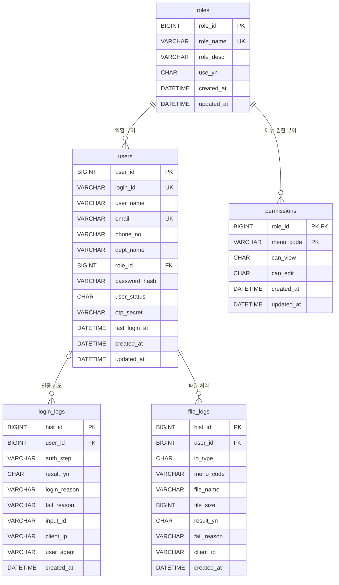

# Admin Core DB 정의서

## 로컬 DB 접속 정보

로컬 MariaDB의 실행 설정은 `infra/local/docker-compose.yml`, 애플리케이션의 JDBC 연결 설정은 `src/main/resources/application-local.yml`에서 관리한다.

### 설정 파일 위치

| 구분 | 파일 위치 | 관리 내용 |
|---|---|---|
| MariaDB 컨테이너 | `infra/local/docker-compose.yml` | MariaDB 버전, 데이터베이스·계정, 포트 매핑, 데이터 볼륨 |
| 애플리케이션 DB 연결 | `src/main/resources/application-local.yml` | JDBC URL, 접속 계정, 드라이버, 스키마 초기화 설정 |
| 테이블 생성 DDL | `src/main/resources/db/schema/admin_core_schema.sql` | 애플리케이션 시작 시 실행하는 테이블 생성문 |

### 기본 접속 정보

| 항목 | 로컬 기본값 |
|---|---|
| DBMS | MariaDB 11.4 |
| Host | `localhost` |
| 외부 접속 Port | `13308` |
| 컨테이너 내부 Port | `3306` |
| Database | `admin_core` |
| Username | `admin_core` |
| Password | `admin_core` |
| Root Password | `admin_core` |
| JDBC URL | `jdbc:mariadb://localhost:13308/admin_core?allowPublicKeyRetrieval=true&useSSL=false` |
| JDBC Driver | `org.mariadb.jdbc.Driver` |

위 값은 로컬 개발 환경 전용이다. DBeaver나 DataGrip에서는 Host를 `localhost`, Port를 `13308`, Database와 Username, Password를 각각 `admin_core`로 입력한다.

애플리케이션은 `application-local.yml`의 다음 환경 변수로 데이터베이스명과 계정을 변경할 수 있다.

| 환경 변수 | 지정하지 않았을 때의 값 |
|---|---|
| `ADMIN_CORE_DB_NAME` | `admin_core` |
| `ADMIN_CORE_DB_USER` | `admin_core` |
| `ADMIN_CORE_DB_PASSWORD` | `admin_core` |

Host와 Port는 현재 `application-local.yml`에 `localhost:13308`로 명시되어 있다. 또한 `spring.sql.init.mode`가 `always`이므로 애플리케이션 시작 시 `classpath:db/schema/admin_core_schema.sql`이 실행된다.

MariaDB 클라이언트가 설치되어 있다면 다음과 같이 접속하고, 비밀번호 입력 창에 `admin_core`를 입력한다.

```bash
mariadb -h 127.0.0.1 -P 13308 -u admin_core -p admin_core
```

## 1. 테이블 정의 및 관계도

### 1.1 테이블 목록

| 테이블 | 설명 | Primary Key |
|---|---|---|
| `roles` | 관리자 역할과 역할 활성 상태 | `role_id` |
| `users` | 관리자 계정, 비밀번호 해시, OTP Secret과 사용자 상태 | `user_id` |
| `permissions` | 역할별 메뉴 조회·편집 권한 | `(role_id, menu_code)` |
| `login_logs` | 아이디·비밀번호 로그인과 OTP 인증 이력 | `hist_id` |
| `file_logs` | Excel 등 파일 업로드·다운로드 이력 | `hist_id` |

### 1.2 테이블 관계도



### 1.3 관계 정의

| 부모 테이블 | 자식 테이블 | 관계 | Foreign Key | 설명 |
|---|---|---|---|---|
| `roles` | `users` | 1:N | `users.role_id` | 사용자는 반드시 하나의 역할을 가진다. |
| `roles` | `permissions` | 1:N | `permissions.role_id` | 역할은 여러 메뉴 권한을 가질 수 있다. |
| `users` | `login_logs` | 1:N | `login_logs.user_id` | 로그인·OTP 이력을 저장한다. 사용자 식별 전 실패 이력은 `user_id=NULL`이다. |
| `users` | `file_logs` | 1:N | `file_logs.user_id` | 파일 처리 이력은 반드시 작업 사용자를 가진다. |

- 모든 Foreign Key에는 `ON DELETE CASCADE`를 선언하지 않는다.
- 사용자와 역할은 물리 삭제하지 않고 `users.user_status`, `roles.use_yn`으로 활성 상태를 관리한다.
- 메뉴 Master 테이블은 사용하지 않는다.
- 메뉴 코드, 이름, 경로와 계층은 `AdminMenuDefinition` 코드에서 관리한다.
- `permissions.menu_code`는 코드 메뉴 카탈로그의 메뉴 코드를 참조하지만 DB Foreign Key는 없다.

### 1.4 `roles` 테이블

관리자에게 부여할 역할과 역할의 사용 여부를 저장한다.

| 컬럼 | 타입 | Null | Default | Key | 설명 |
|---|---|---|---|---|---|
| `role_id` | `BIGINT` | N | AUTO_INCREMENT | PK | 역할 고유번호 |
| `role_name` | `VARCHAR(100)` | N | - | UK | 중복할 수 없는 역할명 |
| `role_desc` | `VARCHAR(255)` | Y | `NULL` | - | 역할의 업무 범위와 설명 |
| `use_yn` | `CHAR(1)` | N | `Y` | INDEX | 역할 사용 여부, `Y` 또는 `N` |
| `created_at` | `DATETIME(6)` | N | - | - | 생성 일시 |
| `updated_at` | `DATETIME(6)` | N | - | - | 최종 수정 일시 |

#### Index

| 이름 | 컬럼 | 유형 |
|---|---|---|
| `PRIMARY` | `role_id` | Primary Key |
| `uq_roles_name` | `role_name` | Unique Key |
| `idx_roles_use_yn` | `use_yn` | Index |

### 1.5 `users` 테이블

관리자 계정, 프로필, 역할, 비밀번호와 OTP 인증 정보를 저장한다.

| 컬럼 | 타입 | Null | Default | Key | 설명 |
|---|---|---|---|---|---|
| `user_id` | `BIGINT` | N | AUTO_INCREMENT | PK | 사용자 고유번호 |
| `login_id` | `VARCHAR(100)` | N | - | UK | 중복할 수 없는 로그인 ID |
| `user_name` | `VARCHAR(100)` | N | - | INDEX | 사용자명 |
| `email` | `VARCHAR(100)` | N | - | UK | 중복할 수 없는 이메일 |
| `phone_no` | `VARCHAR(20)` | Y | `NULL` | - | 휴대폰번호 |
| `dept_name` | `VARCHAR(50)` | Y | `NULL` | - | 소속 또는 부서명 |
| `role_id` | `BIGINT` | N | - | FK, INDEX | `roles.role_id` |
| `password_hash` | `VARCHAR(255)` | N | - | - | BCrypt 비밀번호 해시, 원문 저장 금지 |
| `user_status` | `CHAR(1)` | N | `Y` | INDEX | 사용자 활성 상태, `Y` 또는 `N` |
| `otp_secret` | `VARCHAR(100)` | Y | `NULL` | - | Base32 TOTP Secret, OTP 등록 전에는 `NULL` |
| `last_login_at` | `DATETIME(6)` | Y | `NULL` | - | 비밀번호와 OTP 인증을 모두 완료한 마지막 로그인 일시 |
| `created_at` | `DATETIME(6)` | N | - | - | 생성 일시 |
| `updated_at` | `DATETIME(6)` | N | - | - | 최종 수정 일시 |

#### Index와 Foreign Key

| 이름 | 컬럼 | 유형·참조 |
|---|---|---|
| `PRIMARY` | `user_id` | Primary Key |
| `uq_users_login_id` | `login_id` | Unique Key |
| `uq_users_email` | `email` | Unique Key |
| `idx_users_role_id` | `role_id` | Index |
| `idx_users_name` | `user_name` | Index |
| `idx_users_status` | `user_status` | Index |
| `fk_users_role` | `role_id` | `roles(role_id)` Foreign Key |

### 1.6 `permissions` 테이블

역할과 메뉴 사이의 조회·편집 권한을 저장한다.

| 컬럼 | 타입 | Null | Default | Key | 설명 |
|---|---|---|---|---|---|
| `role_id` | `BIGINT` | N | - | PK, FK | `roles.role_id` |
| `menu_code` | `VARCHAR(30)` | N | - | PK, INDEX | 메뉴 코드 |
| `can_view` | `CHAR(1)` | N | `N` | - | 조회 허용 여부, `Y` 또는 `N` |
| `can_edit` | `CHAR(1)` | N | `N` | - | 편집 허용 여부, `Y` 또는 `N` |
| `created_at` | `DATETIME(6)` | N | - | - | 생성 일시 |
| `updated_at` | `DATETIME(6)` | N | - | - | 최종 수정 일시 |

#### 지원 메뉴 코드

| 메뉴 코드 | 메뉴명 | 용도 |
|---|---|---|
| `USERS` | 사용자 관리 | 사용자 조회·등록·수정 |
| `ROLES` | 권한 관리 | 역할과 역할별 메뉴 권한 관리 |
| `LOGIN_HISTORY` | 로그인 이력 조회 | 로그인·OTP 감사 이력 조회 |
| `FILE_HISTORY` | 파일 이력 조회 | 파일 처리 감사 이력 조회 |

상위 그룹 메뉴인 `OPERATIONS`는 `permissions`에 저장하지 않는다. 사용자 메뉴 조회 시 하위 메뉴의 상위 그룹으로 자동 포함한다.

`can_edit='Y'`인 메뉴는 반드시 `can_view='Y'`여야 한다. 이 조건은 DB Check Constraint가 아니라 `RoleMenuPermission` Domain 생성 규칙에서 검사한다.

#### Index와 Foreign Key

| 이름 | 컬럼 | 유형·참조 |
|---|---|---|
| `PRIMARY` | `(role_id, menu_code)` | Composite Primary Key |
| `idx_permissions_menu_code` | `menu_code` | Index |
| `fk_permissions_role` | `role_id` | `roles(role_id)` Foreign Key |

### 1.7 `login_logs` 테이블

아이디·비밀번호 로그인과 OTP 인증의 성공·실패 이력을 저장한다.

| 컬럼 | 타입 | Null | Default | Key | 설명 |
|---|---|---|---|---|---|
| `hist_id` | `BIGINT` | N | AUTO_INCREMENT | PK | 로그인 이력 고유번호 |
| `user_id` | `BIGINT` | Y | `NULL` | FK, INDEX | 식별된 사용자 ID. 사용자 식별 전 실패하면 `NULL` |
| `auth_step` | `VARCHAR(20)` | N | - | INDEX | 인증 단계, `LOGIN` 또는 `OTP` |
| `result_yn` | `CHAR(1)` | N | - | INDEX | 인증 성공 여부, `Y` 또는 `N` |
| `login_reason` | `VARCHAR(100)` | Y | `NULL` | - | 사용자가 입력한 관리자 시스템 접속 사유 |
| `fail_reason` | `VARCHAR(255)` | Y | `NULL` | - | 인증 실패 사유 코드 또는 메시지 |
| `input_id` | `VARCHAR(100)` | Y | `NULL` | - | 로그인 요청에 실제 입력한 로그인 ID |
| `client_ip` | `VARCHAR(64)` | Y | `NULL` | - | 요청 클라이언트 IP |
| `user_agent` | `VARCHAR(255)` | Y | `NULL` | - | 요청 User-Agent |
| `created_at` | `DATETIME(6)` | N | - | INDEX | 인증 시도 일시 |

사용자명과 사용자의 실제 로그인 ID는 이력 테이블에 중복 저장하지 않는다. 이력 조회 시 `users`를 Left Join하여 표시한다. `input_id`는 로그인 성공 여부와 관계없이 요청자가 실제 입력한 값을 보존한다.

#### Index와 Foreign Key

| 이름 | 컬럼 | 유형·참조 |
|---|---|---|
| `PRIMARY` | `hist_id` | Primary Key |
| `idx_login_logs_user_id` | `user_id` | Index |
| `idx_login_logs_created_at` | `created_at` | Index |
| `idx_login_logs_step_result` | `(auth_step, result_yn)` | Composite Index |
| `fk_login_logs_user` | `user_id` | `users(user_id)` Foreign Key |

### 1.8 `file_logs` 테이블

사용자·로그인 이력·파일 이력 Excel 다운로드 등 파일 처리 결과를 저장한다.

| 컬럼 | 타입 | Null | Default | Key | 설명 |
|---|---|---|---|---|---|
| `hist_id` | `BIGINT` | N | AUTO_INCREMENT | PK | 파일 이력 고유번호 |
| `user_id` | `BIGINT` | N | - | FK, INDEX | 파일 작업 사용자 ID |
| `io_type` | `CHAR(1)` | N | - | - | 업로드 `U` 또는 다운로드 `D` |
| `menu_code` | `VARCHAR(30)` | N | - | INDEX | 파일 작업이 발생한 메뉴 코드 |
| `file_name` | `VARCHAR(255)` | N | - | - | 처리한 파일명 |
| `file_size` | `BIGINT` | Y | `NULL` | - | KB 단위 파일 크기 |
| `result_yn` | `CHAR(1)` | N | - | - | 성공 여부, `Y` 또는 `N` |
| `fail_reason` | `VARCHAR(255)` | Y | `NULL` | - | 실패 사유, 성공하면 `NULL` |
| `client_ip` | `VARCHAR(64)` | Y | `NULL` | - | 요청 클라이언트 IP |
| `created_at` | `DATETIME(6)` | N | - | INDEX | 파일 처리 일시 |

#### Index와 Foreign Key

| 이름 | 컬럼 | 유형·참조 |
|---|---|---|
| `PRIMARY` | `hist_id` | Primary Key |
| `idx_file_logs_user_id` | `user_id` | Index |
| `idx_file_logs_created_at` | `created_at` | Index |
| `idx_file_logs_menu_code` | `menu_code` | Index |
| `fk_file_logs_user` | `user_id` | `users(user_id)` Foreign Key |

---

## 2. 테이블 CREATE DDL

실행 기준 DDL은 `src/main/resources/db/schema/admin_core_schema.sql`과 동일하다.

```sql
CREATE TABLE IF NOT EXISTS roles (
    role_id BIGINT NOT NULL AUTO_INCREMENT COMMENT '권한 고유번호',
    role_name VARCHAR(100) NOT NULL COMMENT '권한명',
    role_desc VARCHAR(255) NULL COMMENT '권한 설명',
    use_yn CHAR(1) NOT NULL DEFAULT 'Y' COMMENT '사용 여부(Y/N)',
    created_at DATETIME(6) NOT NULL COMMENT '생성일시',
    updated_at DATETIME(6) NOT NULL COMMENT '수정일시',
    PRIMARY KEY (role_id),
    UNIQUE KEY uq_roles_name (role_name),
    KEY idx_roles_use_yn (use_yn)
) ENGINE=InnoDB DEFAULT CHARSET=utf8mb4 COMMENT='관리자 권한';

CREATE TABLE IF NOT EXISTS users (
    user_id BIGINT NOT NULL AUTO_INCREMENT COMMENT '사용자 고유번호',
    login_id VARCHAR(100) NOT NULL COMMENT '로그인 아이디',
    user_name VARCHAR(100) NOT NULL COMMENT '사용자명',
    email VARCHAR(100) NOT NULL COMMENT '이메일',
    phone_no VARCHAR(20) NULL COMMENT '휴대폰번호',
    dept_name VARCHAR(50) NULL COMMENT '소속/부서',
    role_id BIGINT NOT NULL COMMENT '권한 ID',
    password_hash VARCHAR(255) NOT NULL COMMENT '비밀번호 해시',
    user_status CHAR(1) NOT NULL DEFAULT 'Y' COMMENT '사용 상태(Y/N)',
    otp_secret VARCHAR(100) NULL COMMENT 'OTP Secret',
    last_login_at DATETIME(6) NULL COMMENT '최종 로그인 일시',
    created_at DATETIME(6) NOT NULL COMMENT '생성일시',
    updated_at DATETIME(6) NOT NULL COMMENT '수정일시',
    PRIMARY KEY (user_id),
    UNIQUE KEY uq_users_login_id (login_id),
    UNIQUE KEY uq_users_email (email),
    KEY idx_users_role_id (role_id),
    KEY idx_users_name (user_name),
    KEY idx_users_status (user_status),
    CONSTRAINT fk_users_role FOREIGN KEY (role_id) REFERENCES roles(role_id)
) ENGINE=InnoDB DEFAULT CHARSET=utf8mb4 COMMENT='관리자 사용자';

CREATE TABLE IF NOT EXISTS permissions (
    role_id BIGINT NOT NULL COMMENT '권한 ID',
    menu_code VARCHAR(30) NOT NULL COMMENT '메뉴 코드',
    can_view CHAR(1) NOT NULL DEFAULT 'N' COMMENT '조회 권한(Y/N)',
    can_edit CHAR(1) NOT NULL DEFAULT 'N' COMMENT '편집 권한(Y/N)',
    created_at DATETIME(6) NOT NULL COMMENT '생성일시',
    updated_at DATETIME(6) NOT NULL COMMENT '수정일시',
    PRIMARY KEY (role_id, menu_code),
    KEY idx_permissions_menu_code (menu_code),
    CONSTRAINT fk_permissions_role FOREIGN KEY (role_id) REFERENCES roles(role_id)
) ENGINE=InnoDB DEFAULT CHARSET=utf8mb4 COMMENT='권한별 메뉴 접근 권한';

CREATE TABLE IF NOT EXISTS login_logs (
    hist_id BIGINT NOT NULL AUTO_INCREMENT COMMENT '로그인 이력 고유번호',
    user_id BIGINT NULL COMMENT '식별된 사용자 ID',
    auth_step VARCHAR(20) NOT NULL COMMENT '인증 단계(LOGIN/OTP)',
    result_yn CHAR(1) NOT NULL COMMENT '성공 여부(Y/N)',
    login_reason VARCHAR(100) NULL COMMENT '접속 사유',
    fail_reason VARCHAR(255) NULL COMMENT '실패 사유',
    input_id VARCHAR(100) NULL COMMENT '입력 로그인 아이디',
    client_ip VARCHAR(64) NULL COMMENT '접속 IP',
    user_agent VARCHAR(255) NULL COMMENT 'User-Agent',
    created_at DATETIME(6) NOT NULL COMMENT '시도 일시',
    PRIMARY KEY (hist_id),
    KEY idx_login_logs_user_id (user_id),
    KEY idx_login_logs_created_at (created_at),
    KEY idx_login_logs_step_result (auth_step, result_yn),
    CONSTRAINT fk_login_logs_user FOREIGN KEY (user_id) REFERENCES users(user_id)
) ENGINE=InnoDB DEFAULT CHARSET=utf8mb4 COMMENT='로그인 및 OTP 인증 이력';

CREATE TABLE IF NOT EXISTS file_logs (
    hist_id BIGINT NOT NULL AUTO_INCREMENT COMMENT '파일 이력 고유번호',
    user_id BIGINT NOT NULL COMMENT '사용자 ID',
    io_type CHAR(1) NOT NULL COMMENT '처리 구분(U/D)',
    menu_code VARCHAR(30) NOT NULL COMMENT '업무 메뉴 코드',
    file_name VARCHAR(255) NOT NULL COMMENT '파일명',
    file_size BIGINT NULL COMMENT '파일 크기(KB)',
    result_yn CHAR(1) NOT NULL COMMENT '성공 여부(Y/N)',
    fail_reason VARCHAR(255) NULL COMMENT '실패 사유',
    client_ip VARCHAR(64) NULL COMMENT '접속 IP',
    created_at DATETIME(6) NOT NULL COMMENT '처리 일시',
    PRIMARY KEY (hist_id),
    KEY idx_file_logs_user_id (user_id),
    KEY idx_file_logs_created_at (created_at),
    KEY idx_file_logs_menu_code (menu_code),
    CONSTRAINT fk_file_logs_user FOREIGN KEY (user_id) REFERENCES users(user_id)
) ENGINE=InnoDB DEFAULT CHARSET=utf8mb4 COMMENT='파일 업로드 및 다운로드 이력';
```

---

## 3. 로그인 필수 초기 데이터 INSERT

최종 로그인과 보호 API 사용을 위해 다음 데이터가 필요하다.

| 순서 | 데이터 | 필요한 이유 |
|---:|---|---|
| 1 | 활성 역할 | 로그인 과정에서 사용자에게 연결된 역할의 존재와 활성 상태를 검증한다. |
| 2 | 활성 사용자 | 로그인 ID와 BCrypt 비밀번호 해시가 필요하다. OTP Secret은 최초 로그인 후 새로 발급한다. |
| 3 | 역할별 메뉴 권한 | 로그인 후 사용자·역할·이력 API에 접근하기 위해 필요하다. |

### 3.1 개발용 초기 계정

| 항목 | 값 |
|---|---|
| 역할명 | `MASTER` |
| 로그인 ID | `master` |
| 초기 비밀번호 | `master` |
| 이메일 | `admin@example.com` |
| 사용자 상태 | `Y` |
| 역할 상태 | `Y` |
| OTP Secret | `NULL` — 1차 로그인 후 새로 발급 |

초기 비밀번호는 Spring Security `BCryptPasswordEncoder`와 호환되는 BCrypt Cost 10 해시로 저장한다.

```text
원문: master
BCrypt: $2a$10$eNWbiNpaiERu9Bxvxqbvgumz0KmlDzNMc3YwXbJoRInY6p8QoILAa
```

초기 INSERT에서는 고정 OTP Secret을 저장하지 않는다. 아이디·비밀번호 인증을 통과한 뒤 OTP 바코드 발급 API가 새로운 무작위 Secret을 생성하고, QR 메일 발송이 성공한 경우에만 `users.otp_secret`에 저장한다.

`admin@example.com`은 예시 주소다. OTP QR 메일을 실제로 받으려면 INSERT 전에 수신 가능한 관리자 이메일로 변경해야 한다.

> 초기 계정과 비밀번호는 로컬·개발 환경 초기 구동 전용이다. 운영 환경에서는 별도의 안전한 초기 계정 생성 절차를 사용해야 한다.

### 3.2 초기 데이터 INSERT 문

다음 SQL은 DDL 실행 후 사용한다. 같은 역할명·로그인 ID·메뉴 권한이 있으면 역할, 계정과 권한을 초기 상태로 갱신한다. 기존 사용자의 OTP Secret은 다시 실행해도 초기화하지 않는다.

```sql
START TRANSACTION;

-- 1. 로그인에 사용할 활성 MASTER 역할을 생성한다.
INSERT INTO roles (
    role_name,
    role_desc,
    use_yn,
    created_at,
    updated_at
) VALUES (
    'MASTER',
    '전체 관리자 기능을 사용할 수 있는 초기 역할',
    'Y',
    NOW(6),
    NOW(6)
)
ON DUPLICATE KEY UPDATE
    role_desc = VALUES(role_desc),
    use_yn = 'Y',
    updated_at = NOW(6);

-- 2. OTP를 아직 발급하지 않은 활성 관리자를 생성한다.
INSERT INTO users (
    login_id,
    user_name,
    email,
    phone_no,
    dept_name,
    role_id,
    password_hash,
    user_status,
    otp_secret,
    last_login_at,
    created_at,
    updated_at
)
SELECT
    'master',
    '초기 관리자',
    'admin@example.com',
    NULL,
    '시스템 운영',
    role_id,
    '$2a$10$eNWbiNpaiERu9Bxvxqbvgumz0KmlDzNMc3YwXbJoRInY6p8QoILAa',
    'Y',
    NULL,
    NULL,
    NOW(6),
    NOW(6)
FROM roles
WHERE role_name = 'MASTER'
ON DUPLICATE KEY UPDATE
    user_name = VALUES(user_name),
    email = VALUES(email),
    role_id = VALUES(role_id),
    password_hash = VALUES(password_hash),
    user_status = 'Y',
    updated_at = NOW(6);

-- 3. MASTER 역할에 모든 업무 메뉴의 조회·편집 권한을 부여한다.
INSERT INTO permissions (
    role_id,
    menu_code,
    can_view,
    can_edit,
    created_at,
    updated_at
)
SELECT
    roles.role_id,
    menu.menu_code,
    'Y',
    'Y',
    NOW(6),
    NOW(6)
FROM roles
JOIN (
    SELECT 'USERS' AS menu_code
    UNION ALL SELECT 'ROLES'
    UNION ALL SELECT 'LOGIN_HISTORY'
    UNION ALL SELECT 'FILE_HISTORY'
) AS menu
WHERE roles.role_name = 'MASTER'
ON DUPLICATE KEY UPDATE
    can_view = 'Y',
    can_edit = 'Y',
    updated_at = NOW(6);

COMMIT;
```

### 3.3 신규 OTP 발급과 최초 로그인 순서

#### 1단계: OTP 메일 설정

OTP 바코드 발급 API는 생성한 QR을 사용자 이메일로 전송한다. OTP 메일은 별도의 활성화 설정 없이 항상 사용한다.
`application.yml`이 환경 변수로 전달받은 SMTP 접속 정보를 `spring.mail`에 바인딩한다. `MailConfig`는 이 설정에
SMTP 인증, STARTTLS와 TLS 1.2를 적용해 `JavaMailSenderImpl`을 생성한다. SMTP 로그인 계정은 메일 발신 주소로도
사용된다.

```yaml
spring:
  mail:
    host: ${SPRING_MAIL_HOST}
    port: ${SPRING_MAIL_PORT}
    username: ${SPRING_MAIL_USERNAME}
    password: ${SPRING_MAIL_PASSWORD}
```

프로젝트를 전달받은 팀은 네 환경 변수에 자신의 SMTP 값을 설정한다. 하나라도 없으면 YAML 설정을 해석하거나
`JavaMailSenderImpl`을 생성할 수 없어 애플리케이션이 시작되지 않는다. SMTP 접속이나 메일 발송에 실패하면 OTP
바코드 발급은 실패하고 `otp_secret`도 저장되지 않는다.

#### 2단계: 아이디·비밀번호 인증

```http
POST /api/v1/auth/login
Content-Type: application/json
```

```json
{
  "loginId": "master",
  "password": "master",
  "loginReason": "초기 관리자 OTP 등록"
}
```

초기 사용자의 `otp_secret`이 `NULL`이므로 응답의 `otpRegistered`는 `false`다. 응답에서 `preAuthToken`을 확인한다.

```json
{
  "code": 200,
  "message": "요청이 정상적으로 처리되었습니다.",
  "data": {
    "preAuthToken": "eyJ...",
    "expiresInSeconds": 300,
    "loginId": "master",
    "name": "초기 관리자",
    "otpRegistered": false
  },
  "error": null
}
```

#### 3단계: 새로운 OTP Secret과 QR 발급

로그인 응답의 `preAuthToken`으로 OTP 바코드 발급 API를 호출한다.

```http
PUT /api/v1/auth/otp/barcode
Content-Type: application/json
```

```json
{
  "preAuthToken": "eyJ..."
}
```

서버는 다음 순서로 처리한다.

1. Pre-Auth JWT와 Redis 사전 인증 상태의 `jti`, 사용자 ID, 인증 목적을 확인한다.
2. 사용자와 역할이 활성 상태인지 확인한다.
3. `SecureRandom`으로 새로운 160비트 값을 만들고 Base32 OTP Secret으로 변환한다.
4. `admin-core:master` 계정의 6자리·30초 TOTP 등록 QR을 생성한다.
5. `users.email`로 QR 이미지를 발송한다.
6. 메일 발송이 성공한 경우에만 새 Secret을 `users.otp_secret`에 저장한다.

```json
{
  "code": 200,
  "message": "요청이 정상적으로 처리되었습니다.",
  "data": null,
  "error": null
}
```

QR이나 OTP Secret은 API 응답으로 노출하지 않는다. 등록 이메일로 받은 QR을 Google Authenticator, Microsoft Authenticator 등의 TOTP 앱에서 스캔한다.

동일 사용자가 바코드 발급 API를 다시 성공하면 기존 Secret 대신 새로 생성한 Secret이 저장된다. 이전 QR로 생성한 OTP 번호는 이후 사용할 수 없다.

#### 4단계: 새로 등록한 OTP 검증

인증 앱에 표시된 숫자 6자리와 같은 `preAuthToken`으로 OTP 인증을 완료한다.

```http
POST /api/v1/auth/otp/verify
Content-Type: application/json
```

```json
{
  "preAuthToken": "eyJ...",
  "otpNumber": "123456"
}
```

`123456`은 형식 예시이므로 실제 요청에는 인증 앱의 현재 번호를 입력한다. 성공하면 Access Token이 응답되고 Refresh Token은 HttpOnly Cookie로 발급된다.

```text
초기 데이터 INSERT
    ↓ otp_secret = NULL
아이디·비밀번호 로그인
    ↓ preAuthToken, otpRegistered = false
OTP 바코드 발급
    ↓ 새 Secret 생성 → QR 메일 성공 → otp_secret 저장
인증 앱 QR 등록
    ↓ 현재 6자리 TOTP 입력
OTP 인증 완료
    ↓ Access Token + Refresh Token Cookie
보호 API 호출
```

### 3.4 초기 데이터와 OTP 발급 결과 확인

```sql
SELECT
    users.user_id,
    users.login_id,
    users.user_name,
    users.user_status,
    users.otp_secret,
    roles.role_id,
    roles.role_name,
    roles.use_yn
FROM users
JOIN roles ON roles.role_id = users.role_id
WHERE users.login_id = 'master';

SELECT
    roles.role_name,
    permissions.menu_code,
    permissions.can_view,
    permissions.can_edit
FROM permissions
JOIN roles ON roles.role_id = permissions.role_id
WHERE roles.role_name = 'MASTER'
ORDER BY permissions.menu_code;
```

초기 INSERT 직후에는 `user_status='Y'`, `use_yn='Y'`, `otp_secret=NULL`이어야 한다. OTP 바코드 메일 발급이 성공한 뒤 같은 조회를 실행하면 `otp_secret`에 새 Base32 Secret이 저장되어 있어야 한다.

두 번째 조회에서는 다음 네 메뉴가 모두 `can_view='Y'`, `can_edit='Y'`여야 한다.

```text
FILE_HISTORY
LOGIN_HISTORY
ROLES
USERS
```
